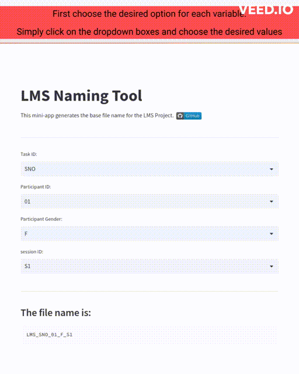

# LMS Naming Tool

[![Open in Streamlit][streamlit-badge]][naming-tool]

## Description

In this repository you can find the `Naming Tool` used to generate the
file names that follows the project Naming convention for the
**Leeds Multi-session Scripted Speech Corpus** (LMS) Project.

## Authors

- PI: Leendert Plug <l.plug@leeds.ac.uk>
- PDRA: James Carter <j.m.a.carter@leeds.ac.uk>
- RSE: Patricia Ternes <p.ternesdallagnollo@leeds.ac.uk>

## File Naming Convention

The LMS Project uses the following naming convention:

`LMS_TSK_ID_G_S#`

where:

- `LMS`: Leeds Multi-session Scripted Speech acronym
- `TSK`: Task code:
  - SYL = Syllable
  - WOR = Words
  - PAS = Passage
  - SNO = Sentences Normal
  - SFA = Sentences Fast
  - SCL = Sentences Clear
- `ID`: Participant identification number (01, 02, …, 19, 20)
- `G`: Participant Gender:
  - F = female
  - M = male
  - N = none/neuter
- `S#`: Session identification number (S1, S2, …, S7, S8)

### File name examples

- LMS_SFA_05_M_S7
- LMS_WOR_03_M_S4
- LMS_SFA_03_F_S1

## Instructions

1. Run the `LMS Naming Tool` on Streamlit by clicking this button [![Open in Streamlit][streamlit-badge]][naming-tool]
2. Use the dropdown boxes to navigate and select the desired values
3. Copy the name (note you can use the copy button)

### Demo:

<!-- links -->
[streamlit-badge]: https://static.streamlit.io/badges/streamlit_badge_black_white.svg
[naming-tool]: https://patricia-ternes-lms-naming-tool-srcapp-g66lps.streamlit.app/